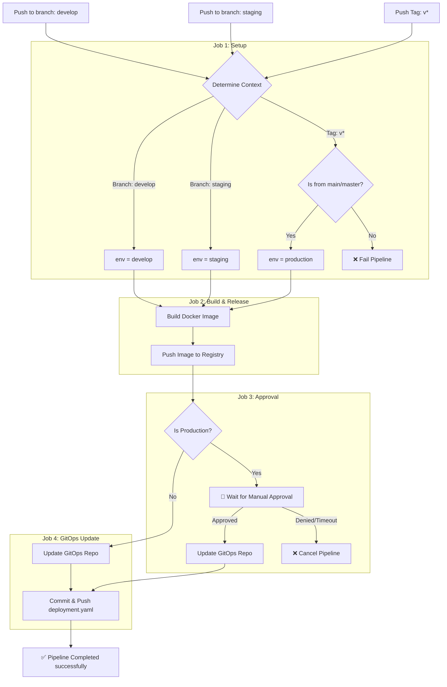

# CI/CD Pipeline Workflow

Dokumen ini menjelaskan alur kerja (workflow) CI/CD untuk aplikasi ini. Pipeline dijalankan menggunakan GitHub Actions dan mencakup proses dari setup, build docker image, rilis ke Docker Registry, hingga update repositori GitOps secara otomatis.

## 📌 Alur Berdasarkan Branch / Tag

Pipeline ini akan secara otomatis terpicu pada kejadian (events) berikut:
1. **Push ke branch `develop`** → Memicu deployment ke *Environment Develop*.
2. **Push ke branch `staging`** → Memicu deployment ke *Environment Staging*.
3. **Push Tag `v*` (contoh: `v1.0.0`)** → Memicu deployment ke *Environment Production*. (Catatan: Tag harus dibuat dari branch `main` atau `master`).

## 🔄 Tahapan Pipeline (Jobs)

Pipeline terdiri dari 4 tahapan (jobs) utama:

1. **🔍 Setup Environment (`setup`)**
   - Menentukan lingkungan (env) berdasarkan referensi yang masuk (apakah `develop`, `staging`, atau `production`).
   - Mengambil metadata commit (SHA, author, message).
   - Mengirimkan notifikasi ke `ntfy` bahwa pipeline telah dimulai.

2. **🏗️🚀 Build & Release (`build-and-release`)**
   - Berjalan langsung setelah proses `setup` selesai.
   - Melakukan build Docker Image menggunakan konfigurasi `Makefile` (`make build`).
   - Mengunggah (push) image tersebut ke Docker Registry (`make release`).
   - Mengirim notifikasi berhasil/gagal ke `ntfy`.

3. **🚦 Manual Approval (`approval`)**
   - **Hanya berjalan untuk Production (Tag).**
   - Pipeline akan terhenti sementara dan membuat sebuah isu (issue) di GitHub yang meminta persetujuan manual dari *approver*.
   - Jika disetujui, pipeline akan lanjut. Jika ditolak atau *timeout* (1 Jam), pipeline dibatalkan.
   - Untuk branch `develop` dan `staging`, langkah ini akan di-**skip** secara otomatis.

4. **🔄 GitOps Update (`gitops-update`)**
   - Untuk `develop` dan `staging`: Berjalan langsung setelah `build-and-release` selesai.
   - Untuk `production`: Berjalan setelah mendapatkan persetujuan pada tahap `approval`.
   - Meng-clone repositori GitOps (__GITOPS_REPO__).
   - Memperbarui image tag di file `deployment.yaml` sesuai dengan environment yang dituju.
   - Melakukan commit dan push ke repositori GitOps yang mana nantinya akan dideteksi dan diaplikasikan oleh ArgoCD (atau tools GitOps lainnya).
   - Mengirim notifikasi sukses/gagal ke `ntfy`.

---

## 📊 Diagram Alur Pipeline (Mermaid)

Berikut adalah ilustrasi visual dari CI/CD flow:

## 🔔 Notifikasi
Setiap tahap yang krusial (Mulai, Build Sukses/Gagal, Release Gagal, dan GitOps Sukses/Gagal) akan mengirimkan notifikasi instan melalui saluran ntfy sehingga tim pengembang (developer) selalu terinformasi mengenai status pipeline.
